# MAAT REQ Proof Of Concept to Support Timed Requirements Design Using Algebraic Process Models


## WHY

Enable validation of critical real-time systems early in the development cycle

Requirements of real-time systems are often expressed informally, increasing the risk of missing or contradictory requirements 

Validation of temporal aspects and process concurrency shall be properly considered 

## WHAT

MAAT REQ : A Proof of Concept to improve requirements using formal analysis and testing techniques :

Dedicated grammar for the expression of functional requirements of real-time systems

Incorporates the recommendations of standardization organizations

Analysis based on clocked process algebra models

## DEMO MATERIAL
[download here demo material zip](https://drive.google.com/file/d/1Ux_wrr3lh6K41wtF4wLvRhvQmA1VVEaw/view?usp=share_link)

# Outline <a name="outline"></a>

1. [MAAT REQ approach](#workflow)
2. [Rephrase Timed Requirements](#req-design)
3. [Transform into Clocked Process Algebra](#transfo)
4. [Analyse Clocked Process Algebra and Requirements Quality Review](#analysis)
<!--
5. [Other example](#other-example)
-->


## MAAT REQ approach <a name="workflow"></a>

<p align="center">
          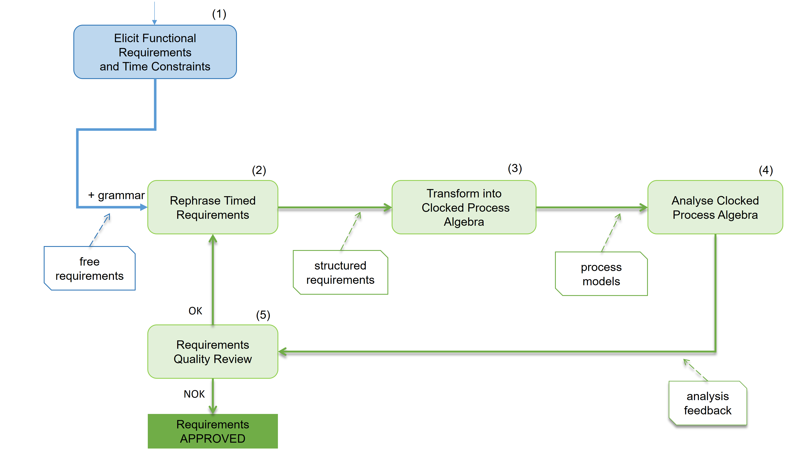
</p>


MAAT REQ proposes an iterative refinement approach: 

From a collection of timed functional requirements in natural language (1),
the requirements engineer rephrases the requirements using the grammar (2) : clarification of preconditions including triggers and causality, system responses, timeframes and deadlines.

Structured requirements are then automatically aggregated and a clocked process model is generated (3).

Formal analyses are performed on the clocked process model and a requirements consistency report is produced (4).

The requirements engineer can either approve or revise the requirements (5) and in latter case reiterate the analysis (2).

[Outline](#outline)

## Rephrase Timed Requirements <a name="req-design"></a>

| Req ID | Statement |
| :---: | :--- |
|R0| **the** system **shall** **init**|
|R1| **when** the set button is pressed **upon** **init**, <br/>**the** system **shall** activate the alarm **immediately after** 60s|
|R2| **when** motion is detected **upon** the alarm activation, <br/>**the** system **shall** emit a tone **immediately**|
|R3| **upon** tone emission, <br/>**the** system **shall** **start time period** 300s|
|R4| **inside time period** 300s [ **scope** ] ( R3 ) **when** the alarm is disarmed, <br/>**the** system **shall** turn off the tone immediately [ **goto** ] ( R1 )|
|R5| **inside time period** 300s [**scope**] ( R3 ) **at end time period** 300s [ **scope** ] ( R3 ), <br/>**the** system **shall** turn off the tone **immediately**|
|R6| **inside time period** 300s [**scope**] ( R3 ) **when** the alarm is disarmed **upon** turning off the tone [ **ref** ] ( R5 ), <br/>**the** system shall **donothing** [ **goto** ] ( R1 )|
|R7| **upon** tone emission, <br/>**the** system **shall** **start time period** 60s| 
|R8| **inside time period** 60s [ **scope** ] ( R7 ) **when** the alarm is disarmed, <br/>**the** system **shall** **donothing**|  
|R9| **inside time period** 60s [**scope**] ( R7 ) **at end time period** 60s [ **scope** ] ( R7 ), <br/>**the** system **shall** alert the emergency center [ **goto** ] ( R7 )|


<!-- Grammar -->

### Grammar


```EBNF
glossary     ::= "Glossary" : ( section ":" ( glossary-item-definition ":" glossary-item-description )* )* ;
glossary-item-definition  ::= glossary-item ( "||" glossary-item-synonym )* ;
section                   ::= "Components" | "Events" | "Actions" ;
requirements              ::= "Requirements" : ( requirement )* ;

requirement  ::= req-ID : precondition*, "the" component "shall" realization ;

precondition ::= causality-condition | trigger-condition 
            | inside-time-period-condition | end-time-period-condition ;

trigger-condition            ::= ( "when" | "if" ) event within-time-condition ? ;
causality-condition          ::= ( "upon" | "after" ) action ( "[" "ref" "]" "(" req-ID ")" ) ? ;
inside-time-period-condition ::= "inside" "time" "period" time "[" "scope" "]" "(" req-ID ")" ;
end-time-period-condition    ::= "at" "end" "time" "period" time "[" "scope" "]" "(" req-ID ")" ;
within-time-condition        ::= "within" time "to" ( time | "infinity" ) ;

realization ::= ( response-action | time-action | response-and-time-action )  iteration ? ;

response-action          ::= action within-time-condition ? ;  
time-action              ::= "start" "time" "period" time
                        | "exit" "time" "period" time "[" "scope" "]" "(" req-ID ")" ;
response-and-time-action ::= ( response-action "and" time-action ) | (time-action "and" response-action ) ; 

iteration ::= ( "[" "goto" "]" | "[" "resume" "]" ) "(" req-ID ")" ;
```
N.B. We require at most one occurrence of each precondition of some nature.

Particular cases for within time conditions where d is some time :

at least after d = within d to infinity

at most before d = within 0 to d 

immediately after d = within d to d

immediately = within 0 to 0


### causality - triggers

<p align="center">
          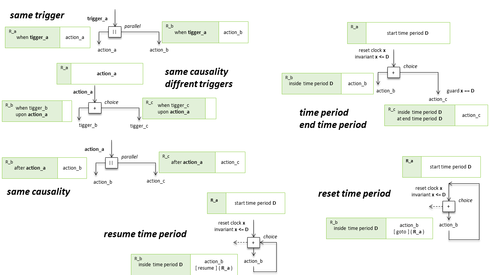
</p>


<!--
# causality - within time condition

<p align="center">
          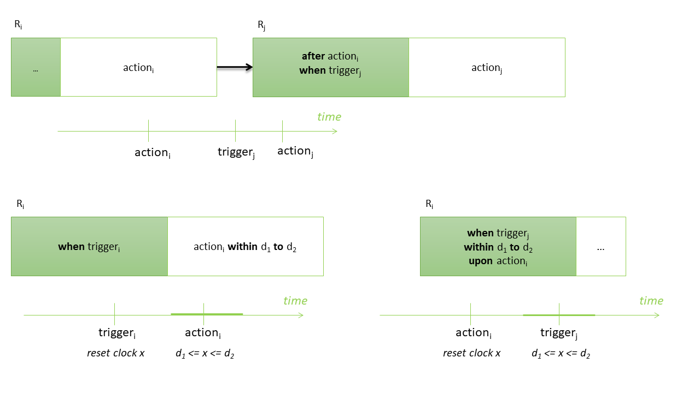
</p>

# inside time period - end time period - goto action

<p align="center">
          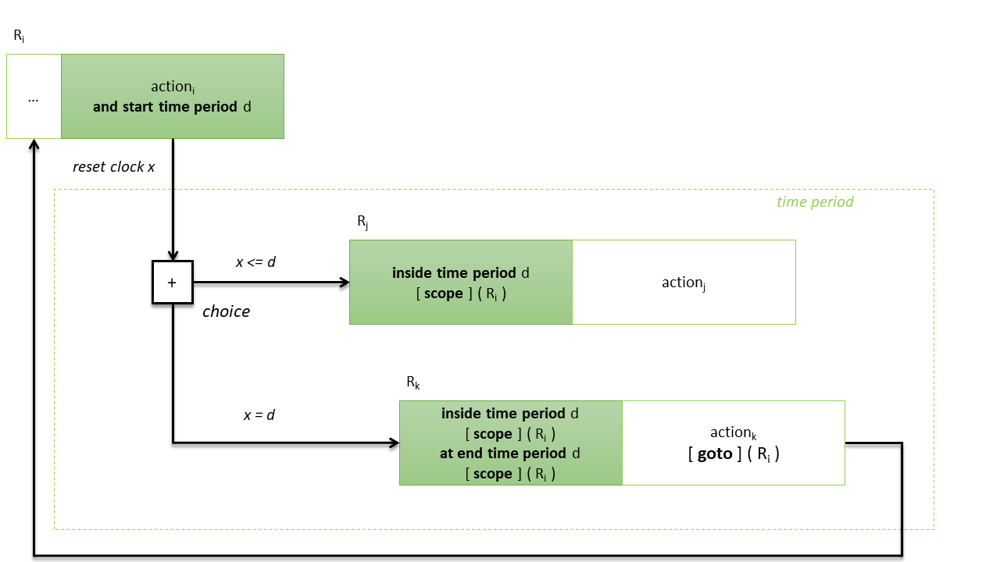
</p>
-->


[Outline](#outline)

## Transform into Clocked Process Algebra <a name="transfo"></a>

### Target Clocked Process Algbera

Clocked Processes are defined by the following syntax :

$$ 
P \quad::=\quad \\{x:=0\\}\_{ x \in R } \\, \psi \\, \triangleright +\_{i\in I} (\phi_i,a_i).P_i \quad|\quad P\\, |\\!\\{A\\}\\!| \\,P  \quad|\quad free( P ) \quad|\quad K
$$

<div align="center">
                    
| process syntax | description |
| --- | --- |
| $$(\phi_i,a_i).P_i$$ | prefix process performs action $a_i$ <br/> guarded by clock constraint $\phi_i$ <br/> and then behaves like process $P_i$|
| $$\\{x:=0\\}\_{ x \in R } \\, \psi \\, \triangleright +\_{i\in I} (\phi_i,a_i).P_i$$ | sum of processes $+\_{i\in I} (\phi_i,a_i).P_i$ </br> performed upon a reset of clocks from $R$<br/> and executed under a clock invariant $\psi$ <br/> to be satisfied on time passing|
| $$P\\, \\|\\!\\{A\\}\\!\\| \\,P$$ |  parallel composition of processes <br/> that synchronize on actions from $A$|
| $$free(P)$$| behaves like $P$ without initial clock reset |
| $$K$$ | $K$ calls a process definition of the form $K = P$<br/> where $K$ is a unique process identifier <br/> a specification consists of a main process <br/> and a collection of process definitions |

</div>

 Example processes of the Alarm System :

$AlarmSystem =$   //timed with clock x  </br>
 $\quad\\{\\}\top\triangleright ( \top, set\\\_button\\\_is\\\_pressed).$ </br>
 $\quad\\{x:=0\\} x\leq 60 \triangleright (x=60,activate\\_alarm).$ </br> 
 $\quad\\{\\}\top  \triangleright  (\top,motion\\_detected).$</br>	
 $\quad\\{x:=0\\}x \leq 0  \triangleright  (\top,emit\\_tone).($</br>
 $\quad\quad\\{x:=0\\}x \leq 300  \triangleright($</br>
   $\quad\quad\quad(\top,alarm\\_is\\_disarmed).$ </br>
   $\quad\quad\quad\\{x:=0\\}x \leq 0 \triangleright   (\top,tone\\_off).AlarmSystem$ </br>
 $\quad\quad+$   //choice op.</br>
   $\quad\quad\quad(x=300,tone\\_off).$ </br>
   $\quad\quad\quad\\{\\}\top \triangleright   (\top,alarm\\_is\\_disarmed).AlarmSystem)$ </br>
 $\quad\\|\\!\\{alarm\\_is\\_desarmed\\}\\!\\|$ //parallel op. </br>
   $\quad\quad\quad HandleSecurity )$</br>

$HandleSecurity$ =   //timed with clock y </br>
 $\quad\\{y:=0\\}y \leq 60 \triangleright   ($ </br>
  $\quad\quad(\top,alarm\\_is\\_disarmed).0$ // 0 as inactive proc. </br>
 $\quad+$   //choice op.</br>
  $\quad\quad(y=60,alert\\_emergency\\_center).HandleSecurity )$</br>
          
:robot: **DEMO** 
```sh
cd C:/demo/

# Launch the tool here !

  All rights reserved. This program and the accompanying materials 
  are the property of CEA LIST, their use is subject to specific 
  agreement with the CEA LIST.
      @@@@@@&          @@@@@@*                                               |           
      @@@@@@@@        @@@#@@@(                                   .@@@#       |    CEA LIST 2022       
      @@@@ @@@&      @@@%,@@@(    /@@@@@@@@&      #@@@@@@@@#   #@@@@@@@@@    |           
      @@@@ .@@@%    @@@@ ,@@@(   .@@,    @@@@.   (@&.    @@@@   */@@@&***    |    Version 0.8.1 (2022.12.01)       
      @@@@  *@@@(  @@@@  ,@@@(           .@@@#           (@@@,   .@@@#       |           
      @@@@   #@@@*@@@@   ,@@@(   ,@@@@@@@@@@@#   (@@@@@@@@@@@,   .@@@#       |           
      @@@@    @@@@@@@    ,@@@(   @@@&    .@@@#  ,@@@/    (@@@,   .@@@&       |           
      @@@@     @@@@@     ,@@@(   /@@@@@@@@@@@#   %@@@@@@@@@@@,    @@@@@@@    | 
      
> maatTransform C:/demo/ex_alarm_system_v01.req
```

### dependency transformation matrix

| Req ID |R0|R1|R2|R3|R4|R5|R6|R7|R8|R9|
| :-- | :-- | :-- | :-- | :-- | :-- | :-- | :-- | :-- | :-- | :-- |
| R0 | = |&#8611; before | | | | | | | | |
| R1 |&#8627; upon | = |&#8611; before | |&#8626; goto | |&#8626; goto | | | |
| R2 | |&#8627; upon | = |&#8611; before | | | |&#8611; before | | |
| R3 | | |&#8627; upon | = |&#8826; scope |&#8826; scope<br/>&#8614; **deadline** |&#8826; scope | | | |
| R4 | |&#8624; goto | |&#8911; scope | = | |&#8611; before | | | |
| R5 | | | |&#8911; scope<br/>&#8615; **deadline** | | = |&#8611; before<br/>&#8626; **ref** | | | |
| R6 | |&#8624; goto | |&#8911; scope |&#8627; upon |&#8627; upon<br/>&#8624; **ref** | = | | | |
| R7 | | |&#8627; upon | | | | | = |&#8826; scope |&#8826; scope<br/>&#8614; **deadline**<br/>&#8626; goto |
| R8 | | | | | | | |&#8911; scope | = | |
| R9 | | | | | | | |&#8911; scope<br/>&#8615; **deadline**<br/>&#8624; goto | | = |

### dependency diagram


<p align="center">
          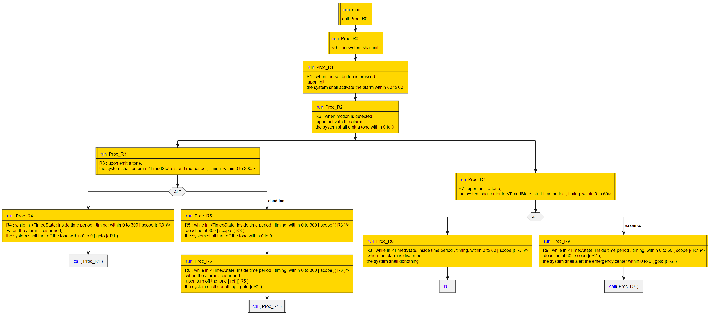
</p>

### process model diagrams


<p align="center">
          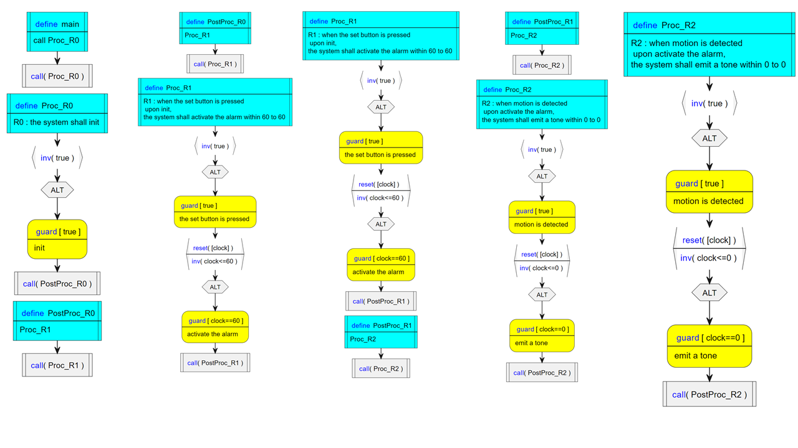
</p>

<p align="center">
          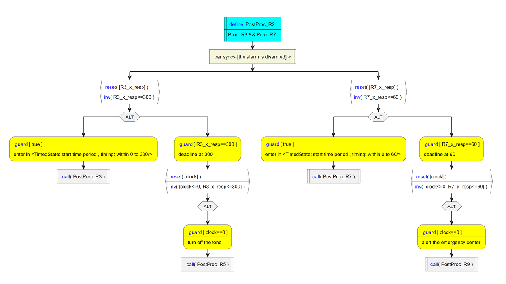
</p>

[Outline](#outline)

<p align="center">
          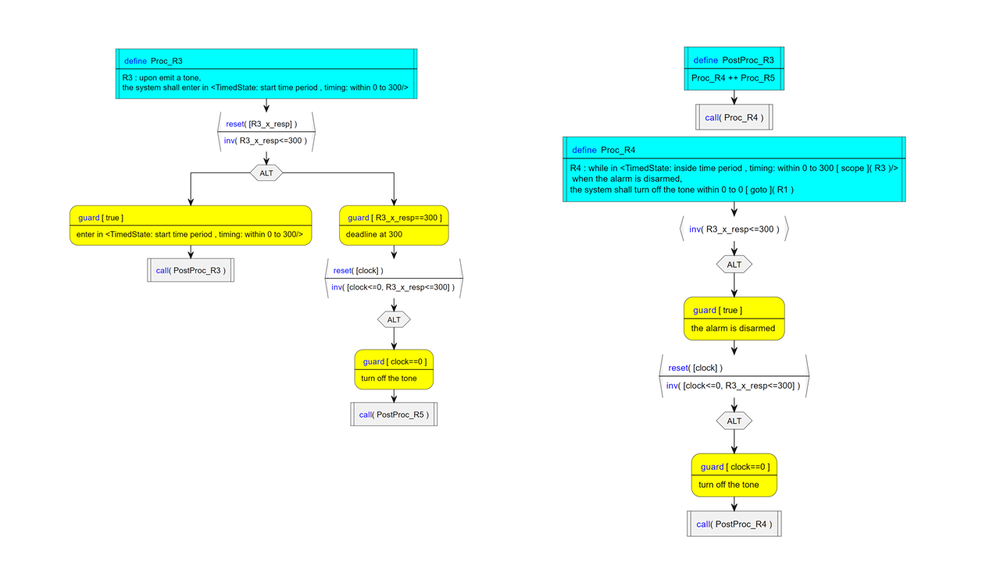
</p>

<p align="center">
          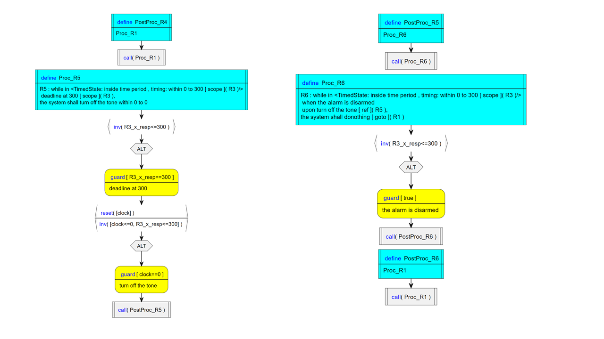
</p>

<p align="center">
          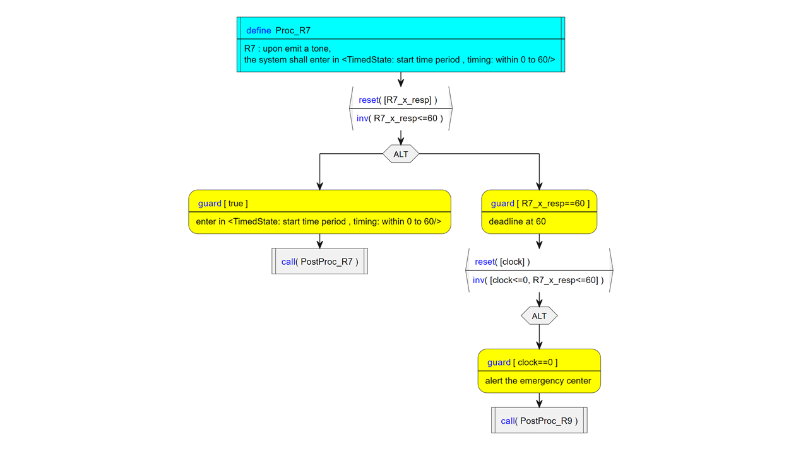
</p>

<p align="center">
          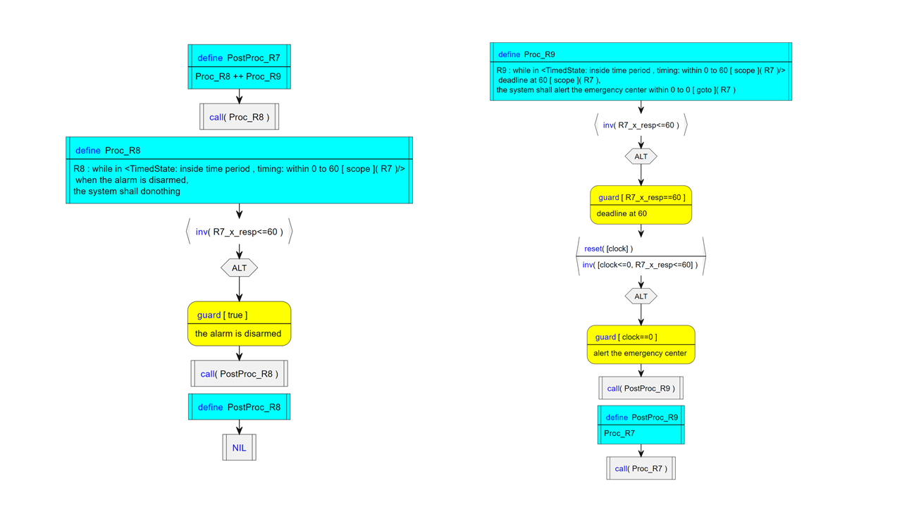
</p>

[Outline](#outline)

## Analyse Clocked Process Algebra and Requirements Quality Review <a name="analysis"></a>

:robot: **DEMO** 
```sh
> maatRun C:/demo/ex_alarm_system_v01.req explore 25
```

### semantic graphs

<p align="center">
          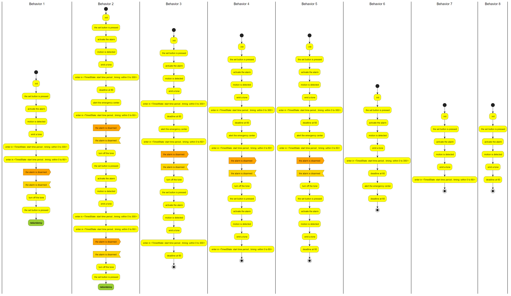
</p>

[Outline](#outline)


<!--

## Other example <a name="other-example"></a>


| req-ID | statement |
| --- | --- |
|NZC-R0| **the** NAZA Core **shall** **init** **and** **start time period** 5s|
|NZC-R1|  **inside time period** 5s [**scope**] ( NZC-R0 ) **upon** **init**,<br/> **the** NAZA Core shall calculate levers setpoints **within** 0s **to** 1s|
|NZC-R2| **inside time period** 5s [**scope**] ( NZC-R0 ) **when** new levers setpoints have been determined **within** 2s **to** 3s **upon** levers setpoints calculation,<br/> **the** NAZA Core **shall** determine common levers using consensus **within** 0s **to** 1s|
|NZC-R3| **inside time period** 5s [**scope**] ( NZC-R0 ) **when** consensus **upon** common levers determination,<br/> **the** NAZA Core **shall** send batteries setpoints|
|NZC-R4| **inside time period** 5s [**scope**] ( NZC-R0 ) **when** consensus **upon** common levers determination,<br/> **the** NAZA Core **shall** send topological orders|
|NZC-R5| **inside time period** 5s [**scope**] ( NZC-R0 ) **when** consensus **upon** common levers determination,<br/> **the** NAZA Core **shall** send modulation orders|
|NZC-R6a| **inside time period** 5s [**scope**] ( NZC-R0 ) **when** consensus **upon** common levers determination,<br/> **the** NAZA Core **shall** wait end of period|
|NZC-R6b| **inside time period** 5s [**scope**] ( NZC-R0 ) **at end time period** 5s [**scope**] ( NZC-R0 ) **upon** waiting the end of period,<br/> **the** NAZA Core **shall** [**goto**] ( NZC-R0 )|
|NZC-R7| **inside time period** 5s [**scope**] ( NZC-R0 ) **if** no result **within** 2s **to** 3s **upon** levers setpoints calculation,<br/> **the** NAZA Core **shall** [**goto**] ( NZC-R0 )|
|NZS-R0|  **the** NAZA Supervisor **shall** **init**|
|NZS-R1| **when** new levers setpoints have been determined **upon** **init**,<br/> **the** NAZA Supervisor **shall** [**goto**] (NZS-R0)|
|NZS-R2| **if** no result **upon** **init**,<br/> **the** NAZA Supervisor **shall** **start time period** 60s|
|NZS-R3| **inside time period** 60s [**scope**] (NZS-R2) **at end time period** 60s [**scope**] (NZS-R2),<br/> **the** NAZA Supervisor **shall** execute backup algorithm [**goto**] (NZS-R0)|
|NZS-R4| **inside time period** 60s [**scope**] (NZS-R2) **when** no result,<br/> **the** NAZA Supervisor **shall** [**resume**] (NZS-R2)|
|NZS-R5| **inside time period** 60s [**scope**] (NZS-R2) **when** new levers setpoints have been determined,<br/> **the** NAZA Supervisor **shall** [**goto**] (NZS-R0)|

# inside time period condition - resume action

<p align="center">
          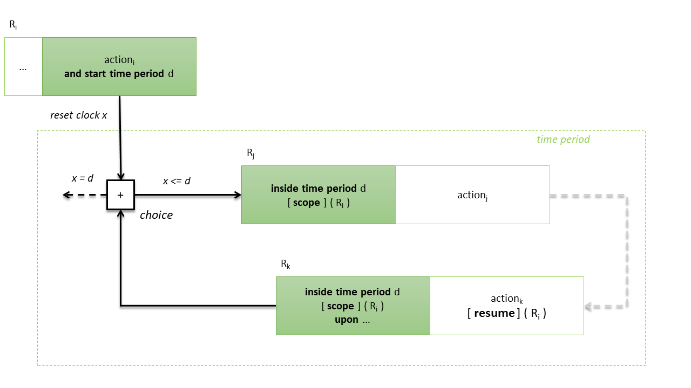
</p>

[Outline](#outline)

We introduce NZC-R0 (NAZA Core) and NZS-R2 (NAZA Supervisor) to explicit a (unique) control point that is starting the time period of 5s (resp. 60s), which allows for goto statements unambiguously to be defined. 

We may omit NZC-R0 because there is only one requirement NZC-R1 which first states some behavior inside the time period 5s. In contrast, we cannot skip NZS-R2 as there are three requirements, (NZS-R3, NZS-R4, NZS-R5), which state behaviors that can occur first in the time period 60s. [goto] (NZS-R3, NZS-R4, NZS-R5) meams that we remove the reset of the period clock.
ISSUE: One would be more precise if the reset is requiered the goto statement must indicate the realization of NZS-2 which is starting the period.

NZS-R2: **if** no result, [ **label** ] (NZS-R2::realization) **the** NAZA Supervisor **shall** **start time period** 60s


alternatives:

realization ::= action time-condition? 
            | action "and" "restart time period" time

**the** NAZA Supervisor **shall** **restart time period** 60s [**goto**] (NZS-R2)

or

**the** NAZA Supervisor **shall** **remain in time period** 60s [**goto**] (NZS-R2)

or we may precise which part of NZRS-R2 to toggle the goto

**the** NAZA Supervisor **shall** **remain in time period** 60s [**goto**] [**realization of**] (NZS-R2)
-->
