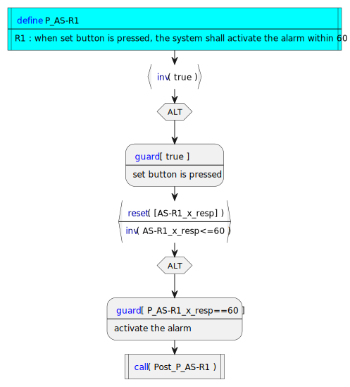

# Demo of the MAAT REQ tool
On Using Algebraic Process Models to Support Time-Sensitive Requirements Design

The objective of the demo is to present the capabilities of the MAAT REQ tool: functional requirement design, transformation into Process Algebra (PA) and analysis, illustrated on a practical example of an Alarm System (and mutants). We can test whether certain requirements can be covered at some point in the PA execution with traceability feedback. Moreover, we can detect various requirement inconsistencies that the tool can highlight as synchronization lacks, deadlocks, or timelocks in the PA execution.


# Outline <a name="outline"></a>

1. [MAAT REQ workflow](#workflow)
2. [Requirement design](#req-design)
3. [Transformation into Process Algbera](#transfo)
4. [Analysis](#analysis)
5. [Other example](#other-example)


## MAAT REQ workflow <a name="workflow"></a>

[Outline](#outline)

## Requirement design <a name="req-design"></a>

| Req-ID | Text |
| :---: | :--- |
|R0| **the** system **shall** **init**|
|R1| **when** the set button is pressed **upon** **init**, <br/>**the** system **shall** activate the alarm **immediately after** 60 seconds|
|R2| **after** the alarm activation, **when** motion is detected, <br/>**the** system **shall** emit a tone **immediately**|
|R3| **after** tone emission, **inside time period** 300 seconds, **when** the alarm is disarmed, <br/>**the** system **shall** turn off the tone immediately [ **goto** ] ( R1 )|
|R4| **when** **timeout at** 300 seconds [ **scope** ] ( R3 ), <br/>**the** system **shall** turn off the tone **immediately**|
|R5| **after** turning off the tone [ **ref** ] ( R4 ), **when** the alarm is disarmed, <br/>**the** system shall [ **goto** ] ( R1 )|
|R6| **after** tone emission, **inside time period** 60 seconds, **when** the alarm is disarmed, <br/>**the** system **shall** [ **donothing** ]|  
|R7| **when** **timeout at** 60 seconds [ **scope** ] ( R6 ), <br/>**the** system **shall** alert the emergency center [ **goto** ] ( R6 )|

<!-- Grammar -->

Grammar

```EBNF
glossary ::= "Glossary" : ( section : ( glossary-item-expression : glossary-item-description )* )*
section ::= components | events | actions | equivalent | time

requirements ::= "Requirements" : ( requirement )*

requirement ::= req-ID : precondition*, "the" component "shall" realization*

precondition ::= "upon" action ( "[" "ref" "]" "(" req-ID ")" ) ? 
            | "when" event | "if" event 
            | "inside" "time period" timing
            | "at timeout after" timing
            | "[" scope "]" "(" req-ID+ ")"

realization ::= action time-condition? 
            | "start time period at" timing
            | "[ goto ]" "(" req-ID+ ")" 
            | "[ donothing ]";
time-condition ::= "within" timing "to" ( timing | infinity )
```
N.B. We require at most one occurrence of each precondition / realization of some nature.

Particular cases for some timing d :

at least after d = within d to infinity

at most before d = within 0 to d 

immediately after d = within d to d

immediately = within 0 to 0


[Outline](#outline)

## Transformation into process algebra <a name="transfo"></a>

unitary requirement transformation


<p align="left">
          
</p>

:robot: **DEMO** 
```sh
maat_req.exe -transform alarm_system.req
```

N.B. By convention, the elements in square brackets [**goto**], [**resume**], [**scope**], and [**ref**] do not have their associated transformation elements but allow to infer information for repetition (or recursion), scoping, and reference.

[Outline](#outline)

## Analysis <a name="analysis"></a>

[Outline](#outline)


## Other example <a name="other-example"></a>


| req-ID | statement |
| --- | --- |
|NZC-R0| **the** NAZA Core **shall** **init** **and** **start time period** 5s|
|NZC-R1|  **upon** **init** **inside time period** 5s [**scope**] ( NZC-R0 ),<br/> **the** NAZA Core shall calculate levers setpoints **within** 0s **to** 1s|
|NZC-R2| **inside time period** 5s [**scope**] ( NZC-R0 ) **when** new levers setpoints have been determined **within** 2s **to** 3s **upon** levers setpoints calculation,<br/> **the** NAZA Core **shall** determine common levers using consensus **within** 0s **to** 1s|
|NZC-R3| **inside time period** 5s [**scope**] ( NZC-R0 ) **when** consensus **upon** common levers determination,<br/> **the** NAZA Core **shall** send batteries setpoints|
|NZC-R4| **inside time period** 5s [**scope**] ( NZC-R0 ) **when** consensus **upon** common levers determination,<br/> **the** NAZA Core **shall** send topological orders|
|NZC-R5| **inside time period** 5s [**scope**] ( NZC-R0 ) **when** consensus **upon** common levers determination,<br/> **the** NAZA Core **shall** send modulation orders|
|NZC-R6| **inside time period** 5s [**scope**] ( NZC-R0 ) **at timeout after** 5s [**scope**] ( NZC-R0 ),<br/> **the** NAZA Core **shall** [**goto**] ( NZC-R0 )|
|NZC-R7| **inside time period** 5s [**scope**] ( NZC-R0 ) **if** no result **within** 2s **to** 3s **upon** levers setpoints calculation,<br/> **the** NAZA Core **shall** [**goto**] ( NZC-R0 )|
|NZS-R0|  **the** NAZA Supervisor **shall** **init**|
|NZS-R1| **when** new levers setpoints have been determined **upon** **init**,<br/> **the** NAZA Supervisor **shall** [**goto**] (NZS-R0)|
|NZS-R2| **if** no result **upon** **init**,<br/> **the** NAZA Supervisor **shall** **start time period** 60s|
|NZS-R3| **inside time period** 60s [**scope**] (NZS-R2) **at timeout after** 60s [**scope**] (NZS-R2),<br/> **the** NAZA Supervisor **shall** execute backup algorithm [**goto**] (NZS-R0)|
|NZS-R4| **inside time period** 60s [**scope**] (NZS-R2) **when** no result,<br/> **the** NAZA Supervisor **shall** [**resume**] (NZS-R2)|
|NZS-R5| **inside time period** 60s [**scope**] (NZS-R2) **when** new levers setpoints have been determined,<br/> **the** NAZA Supervisor **shall** [**goto**] (NZS-R0)|

[Outline](#outline)

We introduce NZC-R0 (NAZA Core) and NZS-R2 (NAZA Supervisor) to explicit a (unique) control point that is starting the time period of 5s (resp. 60s), which allows for goto statements unambiguously to be defined. 

We may omit NZC-R0 because there is only one requirement NZC-R1 which first states some behavior inside the time period 5s. In contrast, we cannot skip NZS-R2 as there are three requirements, (NZS-R3, NZS-R4, NZS-R5), which state behaviors that can occur first in the time period 60s. [goto] (NZS-R3, NZS-R4, NZS-R5) meams that we remove the reset of the period clock.
ISSUE: One would be more precise if the reset is requiered the goto statement must indicate the realization of NZS-2 which is starting the period.

NZS-R2: **if** no result, [ **label** ] (NZS-R2::realization) **the** NAZA Supervisor **shall** **start time period** 60s


alternatives:

realization ::= action time-condition? 
            | action "and" "restart time period" timing

**the** NAZA Supervisor **shall** **restart time period** 60s [**goto**] (NZS-R2)

or

**the** NAZA Supervisor **shall** **remain in time period** 60s [**goto**] (NZS-R2)

or we may precise which part of NZRS-R2 to toggle the goto

**the** NAZA Supervisor **shall** **remain in time period** 60s [**goto**] [**realization of**] (NZS-R2)

