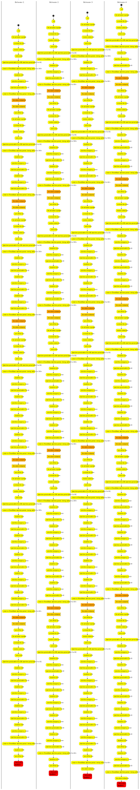
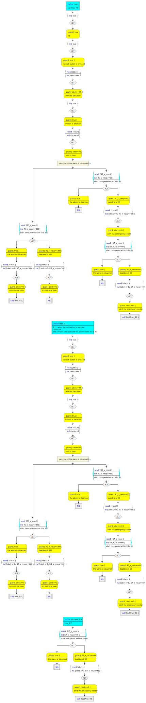
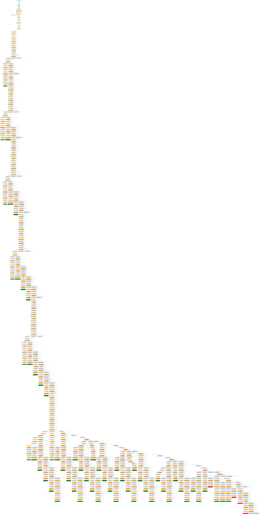

# Alarm System (without R6) Sample

## Outline 

- [Alarm System (without R6) Sample](#alarm-system-without-r6-sample)
	- [Outline](#outline)
	- [MAAT REQ workflow](#maat-req-workflow)
	- [Requirement design](#requirement-design)
	- [Consistency Analysis](#consistency-analysis)
		- [Evaluation Reporting](#evaluation-reporting)
		- [Deadlock Behaviors](#deadlock-behaviors)
	- [Analysis details](#analysis-details)
		- [Transformation into process algebra](#transformation-into-process-algebra)
			- [Dependency Matrix](#dependency-matrix)
			- [Dependency Graph](#dependency-graph)
			- [Process Algebra: fully unfolded diagram](#process-algebra-fully-unfolded-diagram)
		- [Process Algebra Analysis](#process-algebra-analysis)
			- [Exploration Graph](#exploration-graph)
		- [The end !](#the-end-)

## MAAT REQ workflow


[Outline](#outline)


## Requirement design 

| Req ID | Statement |
| :---: | :--- |
|R0| **the** system **shall** **init**|
|R1| **when** the set button is pressed **upon** **init**, <br/>**the** system **shall** activate the alarm **immediately after** 60s|
|R2| **when** motion is detected **upon** the alarm activation, <br/>**the** system **shall** emit a tone **immediately**|
|R3| **upon** tone emission, <br/>**the** system **shall** **start time period** 300s|
|R4| **inside time period** 300s [ **scope** ] ( R3 ) **when** the alarm is disarmed, <br/>**the** system **shall** turn off the tone immediately [ **goto** ] ( R1 )|
|R5| **inside time period** 300s [**scope**] ( R3 ) **at end time period** 300s [ **scope** ] ( R3 ), <br/>**the** system **shall** turn off the tone **immediately**|
|R6| **inside time period** 300s [**scope**] ( R3 ) **when** the alarm is disarmed **upon** turning off the tone [ **ref** ] ( R5 ), <br/>**the** system shall **donothing** [ **goto** ] ( R1 )|
|R7| **upon** tone emission, <br/>**the** system **shall** **start time period** 60s| 
|R8| **inside time period** 60s [ **scope** ] ( R7 ) **when** the alarm is disarmed, <br/>**the** system **shall** **donothing**|  
|R9| **inside time period** 60s [**scope**] ( R7 ) **at end time period** 60s [ **scope** ] ( R7 ), <br/>**the** system **shall** alert the emergency center [ **goto** ] ( R7 )|


[Outline](#outline)


## Consistency Analysis

:robot: **DEMO** 
```sh
cd demo/examples/alarm_system_without_R6/

# Launch the Maat-Req tool here !

  All rights reserved. This program and the accompanying materials 
  are the property of CEA LIST, their use is subject to specific 
  agreement with the CEA LIST.
      @@@@@@&          @@@@@@*                                               |           
      @@@@@@@@        @@@#@@@(                                   .@@@#       |    CEA LIST 2022       
      @@@@ @@@&      @@@%,@@@(    /@@@@@@@@&      #@@@@@@@@#   #@@@@@@@@@    |           
      @@@@ .@@@%    @@@@ ,@@@(   .@@,    @@@@.   (@&.    @@@@   */@@@&***    |    Version 0.8.1 (2022.12.01)       
      @@@@  *@@@(  @@@@  ,@@@(           .@@@#           (@@@,   .@@@#       |           
      @@@@   #@@@*@@@@   ,@@@(   ,@@@@@@@@@@@#   (@@@@@@@@@@@,   .@@@#       |           
      @@@@    @@@@@@@    ,@@@(   @@@&    .@@@#  ,@@@/    (@@@,   .@@@&       |           
      @@@@     @@@@@     ,@@@(   /@@@@@@@@@@@#   %@@@@@@@@@@@,    @@@@@@@    |           

osgi> maatRun alarm_system_without_R6.req explore 300
```


[Outline](#outline)


### Evaluation Reporting

As we can see in the following evaluation report, 
all 10 labels are covered after 29 evalauation steps in BFS strategy.

```sh
*****************************************
************** EVAL REPORT **************
*****************************************
Strategy   : DFS
Redundancy : SEMANTIC_SUBSET
Step count : 300 / max: 300
Height max : 241
Redundancy count : 57
Deadlock   count : 4
None Sync Action : 4
Unsatisfiable Invariant count : 0
Unsatisfiable Guard     count : 31
```

### Deadlock Behaviors




[Outline](#outline)


## Analysis details


### Transformation into process algebra 
          

N.B. By convention, the elements in square brackets [**goto**], [**resume**], [**scope**], and [**ref**] do not have their associated transformation elements but allow to infer information for repetition (or recursion), scoping, and reference.


[Outline](#outline)


#### Dependency Matrix 

<head>
	<style>
		table,
		thead,
		th,
		td {
			padding: 10px;
			border: 1px solid black;
			border-collapse: collapse;
		}
		th {
			border: 1px solid;
			text-align: center;
		}
		td:nth-child(1) {
			border: 1px solid;
			font-weight:bold;
		}
	</style>
</head>

| Req ID |R0|R1|R2|R3|R4|R5|R7|R8|R9|
| :-- | :-- | :-- | :-- | :-- | :-- | :-- | :-- | :-- | :-- |
| R0 | = |&#8611; before | | | | | | | |
| R1 |&#8627; upon | = |&#8611; before | |&#8626; goto | | | | |
| R2 | |&#8627; upon | = |&#8611; before | | |&#8611; before | | |
| R3 | | |&#8627; upon | = |&#8826; scope |&#8826; scope<br/>&#8614; **deadline** | | | |
| R4 | |&#8624; goto | |&#8911; scope | = | | | | |
| R5 | | | |&#8911; scope<br/>&#8615; **deadline** | | = | | | |
| R7 | | |&#8627; upon | | | | = |&#8826; scope |&#8826; scope<br/>&#8614; **deadline**<br/>&#8626; goto |
| R8 | | | | | | |&#8911; scope | = | |
| R9 | | | | | | |&#8911; scope<br/>&#8615; **deadline**<br/>&#8624; goto | | = |


[Outline](#outline)


#### Dependency Graph 


[Other dependency graphs](dependency_graph.md)


[Outline](#outline)


#### Process Algebra: fully unfolded diagram 




[Outline](#outline)


### Process Algebra Analysis 

#### Exploration Graph 



[The fully detailed process algebra evaluation graph](evaluation_graph.md)


[Outline](#outline)

### The end !

